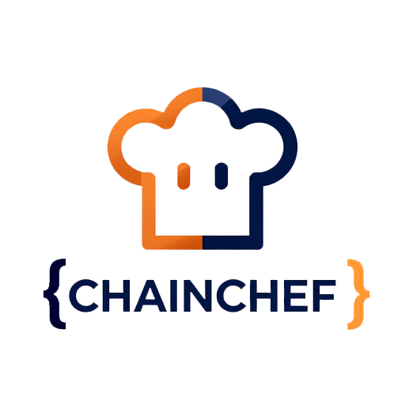
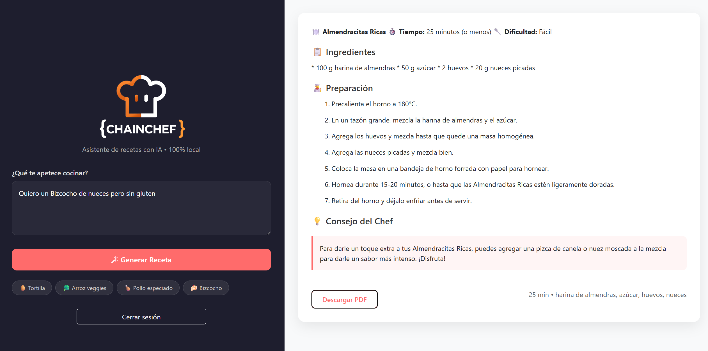

# 🚀 ChainChef — AI Recipe Assistant (Local & Private)
## 🏷️ **Tech Stack**

<p align="left">
  
  
  
  
  
  
  
  
  
</p>

---
<p align="center">
  
</p>

---

## 📌 **Project Overview**

**ChainChef** es un asistente de cocina inteligente que funciona completamente **en local**, sin enviar datos a la nube.  
Gracias a **Ollama** y **LangChain**, entiende tu lenguaje natural, extrae ingredientes, restricciones y tiempo, y genera recetas personalizadas al instante.

Escribe _"Quiero una tortilla de patatas con cebolla, sin gluten, en 20 minutos"_ y obtendrás una receta completa, con cantidades en sistema métrico y la posibilidad de descargarla en PDF.

**Todo desde tu ordenador. Privacidad total.**

---

## ✨ **Features**

- 🤖 **IA 100% local** con Ollama (`llama3:instruct`)  
- ⛓️ **LangChain** para encadenar prompts y extraer datos estructurados  
- ⏱️ **Recetas adaptadas** a tus ingredientes, alergias y tiempo disponible  
- 📄 **Descarga en PDF** con un solo clic  
- 🎨 **Interfaz moderna** (panel izquierdo fijo, resultados a la derecha)  
- 🔒 **Autenticación JWT** (login y registro)  
- 🗂️ **SQLite** para persistencia de usuarios  
- 💻 **Instalador para Windows** (no requiere Python ni conocimientos técnicos)  

---

## 🖼️ **Screenshots**

<p align="center">
  
</p>

---

## 📁 **Project Structure**

```
ChainChef/
├── app/                         # Backend FastAPI
│   ├── ia/                      # LangChain chains y prompts
│   │   ├── chains.py
│   │   └── prompts.py
│   ├── routers/                 # Endpoints API
│   │   ├── receta_router.py
│   │   ├── auth_router.py
│   │   ├── user_router.py
│   │   └── book_router.py
│   ├── services/                # Lógica de negocio
│   │   ├── receta_service.py
│   │   ├── auth_service.py
│   │   └── ...
│   ├── schemas/                 # Pydantic schemas
│   │   ├── receta_schema.py
│   │   └── ...
│   ├── models/                  # SQLAlchemy models
│   ├── main.py                  # Punto de entrada FastAPI
│   ├── database.py
│   └── auth.py
├── frontend/                    # Interfaz de usuario
│   ├── index.html               # Login
│   ├── register.html            # Registro
│   ├── recetas.html             # Asistente de recetas
│   ├── styles.css
│   ├── app.js
│   └── img/
├── run_server.py                # Script de arranque
├── ChainChef.spec               # PyInstaller spec
├── ChainChef_Setup.iss          # Script Inno Setup
├── install_ollama.ps1           # Instalador silencioso de Ollama
├── requirements.txt
├── .gitignore
└── README.md
```

---

## 🚀 **How to Run (Development)**

### 1. Create a virtual environment
```bash
python -m venv venv
```

### 2. Activate it
**Windows:**
```bash
venv\Scripts\activate
```
**Linux/Mac:**
```bash
source venv/bin/activate
```

### 3. Install dependencies
```bash
pip install -r requirements.txt
```

### 4. Start Ollama and download the model
```bash
ollama serve
ollama pull llama3:instruct
```

### 5. Start the server
```bash
uvicorn app.main:app --reload
```

### 6. Open the frontend  
Visit `http://127.0.0.1:8000` and start creating recipes!

---

## 🔧 **API Endpoints**

### **Auth**
| Method | Endpoint         | Description        |
|--------|------------------|--------------------|
| POST   | `/auth/login`    | User login         |
| POST   | `/auth/register` | User registration  |

### **Recipes**
| Method | Endpoint            | Description                          |
|--------|---------------------|--------------------------------------|
| POST   | `/recetas/generar`  | Generate a personalized recipe (AI) |

*(Other CRUD endpoints for books and users are also available as inherited from the template)*

---

## 📦 **Windows Installer**

Descarga el instalador desde [Releases](https://github.com/mlidon/ChainChef/releases):

1. Ejecuta `ChainChef_Installer.exe`  
2. Si **Ollama** no está instalado, se descargará e instalará automáticamente  
3. Al finalizar, ChainChef se abrirá listo para usar  

**No requiere Python ni configuración adicional.**

---

## 🧠 **How the AI works**

1. **Extracción**: LangChain analiza tu mensaje con un `PydanticOutputParser` para obtener ingredientes, restricciones y tiempo en formato JSON.
2. **Generación**: Una segunda cadena de LangChain crea la receta completa con formato Markdown, respetando las restricciones y usando unidades métricas.
3. **Frontend**: El resultado se muestra formateado en tiempo real y se puede descargar como PDF.

---

## 🎯 **Purpose of This Project**

Este proyecto forma parte de un viaje de aprendizaje para:

- Dominar **LangChain** y la creación de cadenas con IA local  
- Construir aplicaciones **full-stack** con FastAPI + frontend vanilla  
- Integrar modelos de lenguaje en productos reales sin depender de la nube  
- Crear una base sólida para futuros agentes autónomos  

---

## 📜 **License**

MIT License — feel free to use, modify, and learn from this project.

---

Built with ❤️ by Marc Lidón — [marclidon.com](https://marclidon.com)